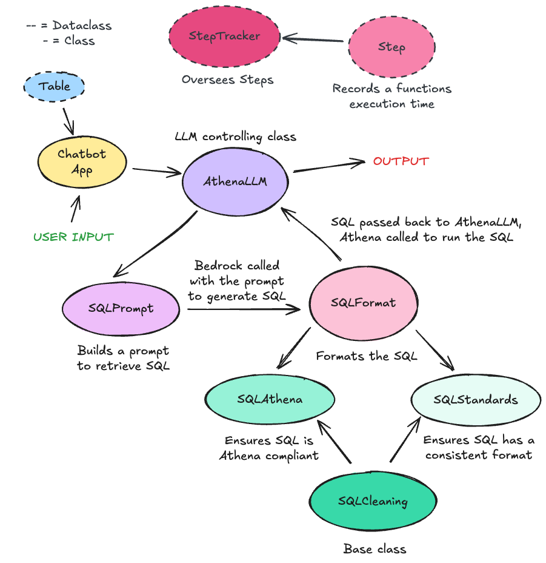
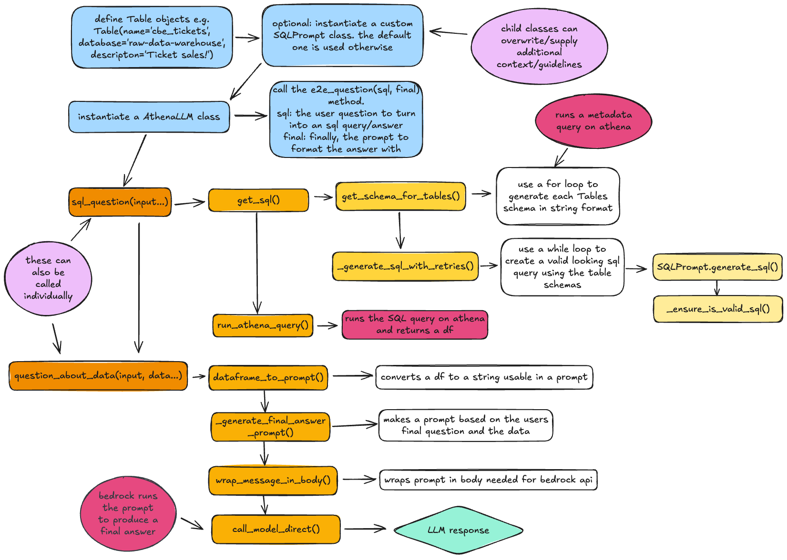
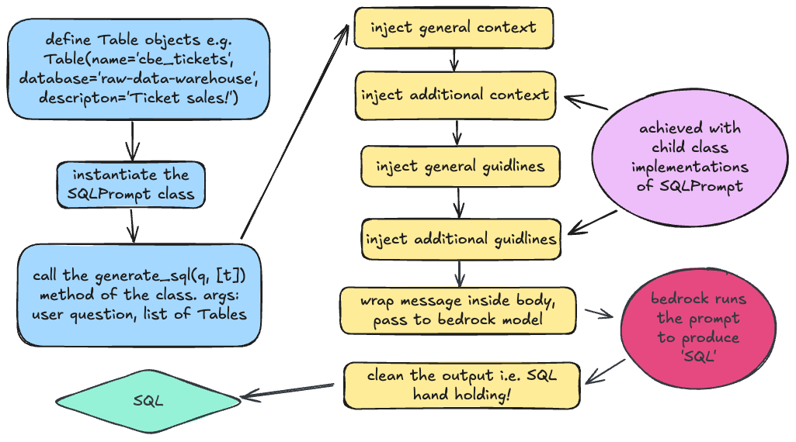

# Athena based LLMs

This directory is concerned with running LLMs on structured data stored in Athena databases

The AthenaLLM class handles prompts. In turn this calls the SQLPrompt class, which can be custom implemented
with child classes if looking to provide additional/custom guidelines/context on how to build SQL queries.

## Class relationships

## Answering user questions

Athena LLM class process flow:

## Building SQL

SQL Prompt class process flow:

