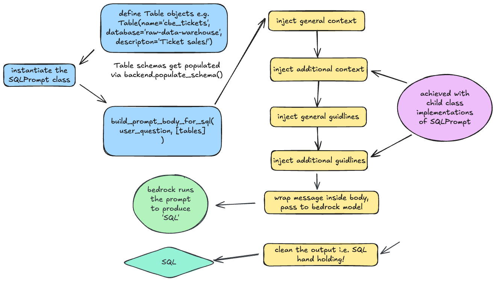

### SQL Prompting

Holds the base `SQLPrompt` class.

Prompts know nothing about a specific backend; they only structure the question/context/guidelines.

When creating a new dialect, supply different template strings or subclass to insert extra instructions.

